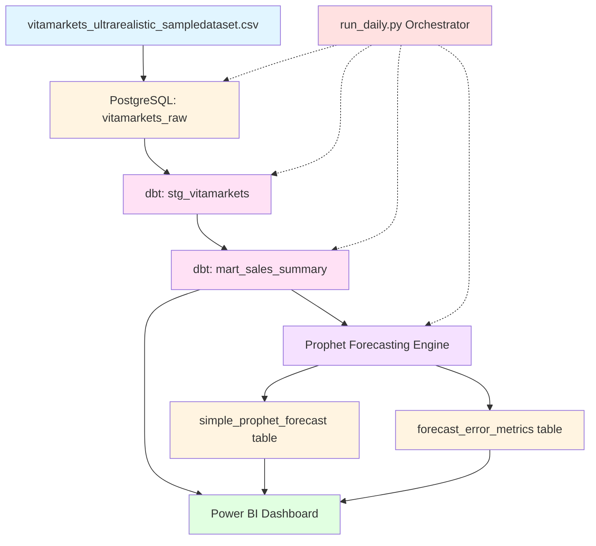

# System Architecture

## Overview

The Vita Markets analytics system is a complete end-to-end pipeline that processes daily sales data, generates forecasts, and delivers executive dashboards. The architecture follows a modern data stack pattern with clear separation of concerns.

## Architecture Diagram



## Component Details

### 1. Data Source (CSV)
- **File:** `vitamarkets_ultrarealistic_sampledataset.csv`
- **Format:** CSV with header row
- **Size:** ~1.7 MB, 50,000+ rows
- **Columns:** 19 fields including date, sku, units_sold, order_value, channel, etc.
- **Time Range:** 2021-01-01 to 2024-11-30 (4 years of daily data)
- **Granularity:** One row per day-sku-channel-country-customer_segment combination

### 2. Raw Data Layer (PostgreSQL)
- **Table:** `public.vitamarkets_raw`
- **Purpose:** Immutable landing zone for source data
- **Load Method:** `\COPY` command in `setup/init_db.sql`
- **Indexes:** Composite primary key on (date, sku, channel, country, customer_segment)
- **Refresh:** Full replace (can be changed to incremental in `etl/refresh_actuals.py`)

### 3. Staging Layer (dbt)
- **Model:** `stg_vitamarkets.sql`
- **Purpose:** Clean and type-cast raw data
- **Transformations:**
  - Cast units_sold to INT
  - Round monetary values to 2 decimal places
  - Filter out null units_sold/order_value
  - Ensure date is proper DATE type
- **Materialization:** View (default in dbt)
- **Output:** `public.stg_vitamarkets`

### 4. Mart Layer (dbt)
- **Model:** `mart_sales_summary.sql`
- **Purpose:** Aggregated KPI table for forecasting and dashboards
- **Aggregations:**
  - `SUM(units_sold)` → `total_units_sold`
  - `SUM(order_value)` → `total_order_value`
  - `COUNT(*)` → `transaction_count`
- **Grain:** One row per date-sku-channel-country-customer_segment
- **Materialization:** Table (can be changed to incremental)
- **Output:** `public.mart_sales_summary`

### 5. Forecasting Engine (Prophet)
- **Script:** `prophet_improved.py`
- **Input:** `mart_sales_summary` table (reads via SQLAlchemy)
- **Algorithm:** Facebook Prophet (v1.1.5)
- **Features:**
  - Weekly seasonality
  - Yearly seasonality
  - Custom holidays (Black Friday, Christmas)
- **Eligibility Filter:** 
  - SKU must have >730 days of data (2+ years)
  - SKU must have >500 total units sold
- **Outlier Handling:** Clip top 1% per SKU to 99th percentile
- **Forecast Horizon:** 90 days
- **Outputs:**
  - `simple_prophet_forecast` table (forecasts + actuals overlay)
  - `forecast_error_metrics` table (MAE per SKU)
  - CSV files in `prophet_forecasts/` directory

### 6. Dashboard Layer (Power BI)
- **File:** `MainDash.pbix`
- **Data Source:** Direct Query to PostgreSQL
- **Tables Used:**
  - `mart_sales_summary` (actuals)
  - `simple_prophet_forecast` (predictions)
  - `forecast_error_metrics` (accuracy)
- **Pages:**
  1. Executive KPI View (YoY growth, top SKUs, revenue trends)
  2. Forecast vs. Actuals (time series overlay with uncertainty bands)
  3. (Additional pages TBD)

### 7. Orchestration (Python)
- **Script:** `scripts/run_daily.py`
- **Steps:**
  1. Run `dbt deps` (install packages)
  2. Run `dbt run` (execute models)
  3. Run `etl/refresh_actuals.py` (load latest CSV)
  4. Run `prophet_improved.py` (generate forecasts)
  5. Run `checkcsv.py` (data quality checks)
- **Logging:** Writes to `logs/run_daily.log` with timestamps
- **Scheduling:** 
  - Local: Windows Task Scheduler (`run_daily.cmd`)
  - Cloud (future): Airflow, Prefect, or GitHub Actions

## Data Flow

```
1. [CSV File] 
     ↓ (Manual upload or scheduled fetch)
2. [PostgreSQL Raw Table]
     ↓ (dbt run: stg_vitamarkets.sql)
3. [Staging View] 
     ↓ (dbt run: mart_sales_summary.sql)
4. [Mart Table]
     ↓ (prophet_improved.py reads via SQLAlchemy)
5. [Prophet Model Fitting]
     ↓ (Forecast generation + evaluation)
6. [Forecast Tables Written to PostgreSQL]
     ↓ (Power BI refreshes data)
7. [Dashboard Updated]
```

## Technology Stack

| Layer | Technology | Purpose |
|-------|-----------|---------|
| **Storage** | PostgreSQL 14 | Transactional database |
| **Transformation** | dbt 1.7 | SQL-based data modeling |
| **Computation** | Python 3.11 | ETL scripts, forecasting |
| **Forecasting** | Prophet 1.1.5 | Time series prediction |
| **Orchestration** | Python subprocess | Scheduled pipeline execution |
| **Visualization** | Power BI Desktop | Dashboards |
| **Version Control** | Git/GitHub | Code repository |

## Python Dependencies

See `etl/requirements.txt`:
- `pandas==2.2.2` - Data manipulation
- `SQLAlchemy==2.0.32` - Database ORM
- `psycopg2-binary==2.9.9` - PostgreSQL adapter
- `prophet==1.1.5` - Forecasting library
- `python-dotenv==1.0.1` - Environment variable management
- `scikit-learn==1.5.1` - Metrics (MAE, RMSE, MAPE)

## Security

- **Credentials:** Stored in `.env` file (gitignored)
- **Database Connection:** Uses SQLAlchemy's connection pooling with `pool_pre_ping=True`
- **SQL Injection:** All queries use parameterized queries or dbt (no raw string concatenation)

## Scalability Considerations

**Current Limitations:**
- Single-machine execution (no distributed computing)
- Full table replace (no incremental loads)
- CSV-based ingestion (no streaming)

**Future Enhancements:**
- Move to cloud (AWS RDS/Redshift or Snowflake)
- Implement incremental dbt models
- Add Airflow for orchestration
- Use S3/GCS for data lake
- Add alerting (email/Slack on failures)

## Monitoring & Observability

**Current State:**
- Logs written to `logs/run_daily.log`
- No structured logging (JSON format)
- No metrics dashboard (Grafana, Datadog)

**Recommended Additions:**
- Structured logging with Python `logging` module
- Pipeline status table in PostgreSQL
- Slack/email alerts on failure
- dbt test results tracked over time

## Dependencies Between Components

```
vitamarkets_raw (table)
  ↓ depends on
stg_vitamarkets (view)
  ↓ depends on
mart_sales_summary (table)
  ↓ depends on
simple_prophet_forecast (table)
  ↓ depends on
Power BI Dashboard
```

**Critical Path:**
If `mart_sales_summary` fails, both forecasting and dashboards break. This is the single point of failure.

## Directory Structure

```
.
├── setup/                    # Database setup scripts
│   └── init_db.sql          # Creates tables, loads CSV
├── etl/                      # Extract-Transform-Load scripts
│   ├── refresh_actuals.py   # CSV → PostgreSQL
│   └── requirements.txt     # Python dependencies
├── vitamarkets_dbt/         # dbt project
│   └── vitamarkets/
│       ├── models/
│       │   ├── stg_vitamarkets.sql
│       │   └── mart_sales_summary.sql
│       └── dbt_project.yml
├── scripts/                  # Orchestration
│   └── run_daily.py         # Master pipeline script
├── prophet_improved.py       # Forecasting engine
├── db.py                     # Database connection helper
└── MainDash.pbix            # Power BI dashboard
```

## How to Run

**Full Pipeline:**
```bash
python scripts/run_daily.py
```

**Individual Steps:**
```bash
# 1. Transform data (dbt)
cd vitamarkets_dbt/vitamarkets
dbt run

# 2. Generate forecasts
python prophet_improved.py

# 3. Validate outputs
python checkcsv.py
```

See `docs/SETUP.md` for detailed setup instructions.
